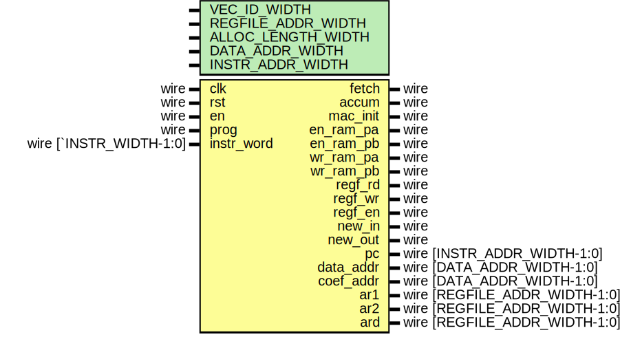

# Entity: ctrl_top
## Diagram

## Description

## Generics and ports
### Table 1.1 Generics
| Generic name       | Type | Value                                                         | Description |
| ------------------ | ---- | ------------------------------------------------------------- | ----------- |
| VEC_ID_WIDTH       |      | 3                                                             |             |
| REGFILE_ADDR_WIDTH |      | 3                                                             |             |
| ALLOC_LENGTH_WIDTH |      | 4                                                             |             |
| DATA_ADDR_WIDTH    |      | 4                                                             |             |
| INSTR_ADDR_WIDTH   |      | + 1 + VEC_ID_WIDTH + 2*REGFILE_ADDR_WIDTH + 3*DATA_ADDR_WIDTH |             |
### Table 1.2 Ports
| Port name  | Direction | Type                          | Description |
| ---------- | --------- | ----------------------------- | ----------- |
| clk        | input     | wire                          |             |
| rst        | input     | wire                          |             |
| en         | input     | wire                          |             |
| prog       | input     | wire                          |             |
| instr_word | input     | wire [`INSTR_WIDTH-1:0]       |             |
| fetch      | output    | wire                          |             |
| accum      | output    | wire                          |             |
| mac_init   | output    | wire                          |             |
| en_ram_pa  | output    | wire                          |             |
| en_ram_pb  | output    | wire                          |             |
| wr_ram_pa  | output    | wire                          |             |
| wr_ram_pb  | output    | wire                          |             |
| regf_rd    | output    | wire                          |             |
| regf_wr    | output    | wire                          |             |
| regf_en    | output    | wire                          |             |
| new_in     | output    | wire                          |             |
| new_out    | output    | wire                          |             |
| pc         | output    | wire [INSTR_ADDR_WIDTH-1:0]   |             |
| data_addr  | output    | wire [DATA_ADDR_WIDTH-1:0]    |             |
| coef_addr  | output    | wire [DATA_ADDR_WIDTH-1:0]    |             |
| ar1        | output    | wire [REGFILE_ADDR_WIDTH-1:0] |             |
| ar2        | output    | wire [REGFILE_ADDR_WIDTH-1:0] |             |
| ard        | output    | wire [REGFILE_ADDR_WIDTH-1:0] |             |
## Signals, constants and types
### Signals
| Name        | Type                          | Description |
| ----------- | ----------------------------- | ----------- |
| en_devs     | wire                          |             |
| vector_pass | wire                          |             |
| last_stage  | wire                          |             |
| last_vector | wire                          |             |
| ostate      | wire [2:0]                    |             |
| pc_clr      | wire                          |             |
| pc_incr     | wire                          |             |
| clr         | wire                          |             |
| vector_id   | wire [VEC_ID_WIDTH-1:0]       |             |
| result_reg  | wire [REGFILE_ADDR_WIDTH-1:0] |             |
| error_reg   | wire [REGFILE_ADDR_WIDTH-1:0] |             |
| vector_len  | wire [ALLOC_LENGTH_WIDTH-1:0] |             |
| data_uptr   | wire [DATA_ADDR_WIDTH-1:0]    |             |
| data_lptr   | wire [DATA_ADDR_WIDTH-1:0]    |             |
| coef_ptr    | wire [DATA_ADDR_WIDTH-1:0]    |             |
| lstg_f      | wire                          |             |
| upse_f      | wire                          |             |
| cnt         | wire                          |             |
## Instantiations
- **ctrl_regfdrv_dut**: ctrl_regfdrv

